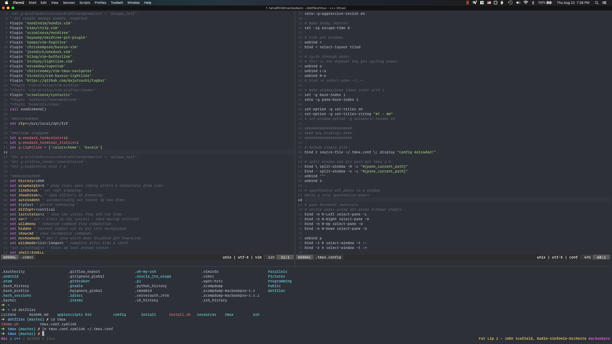
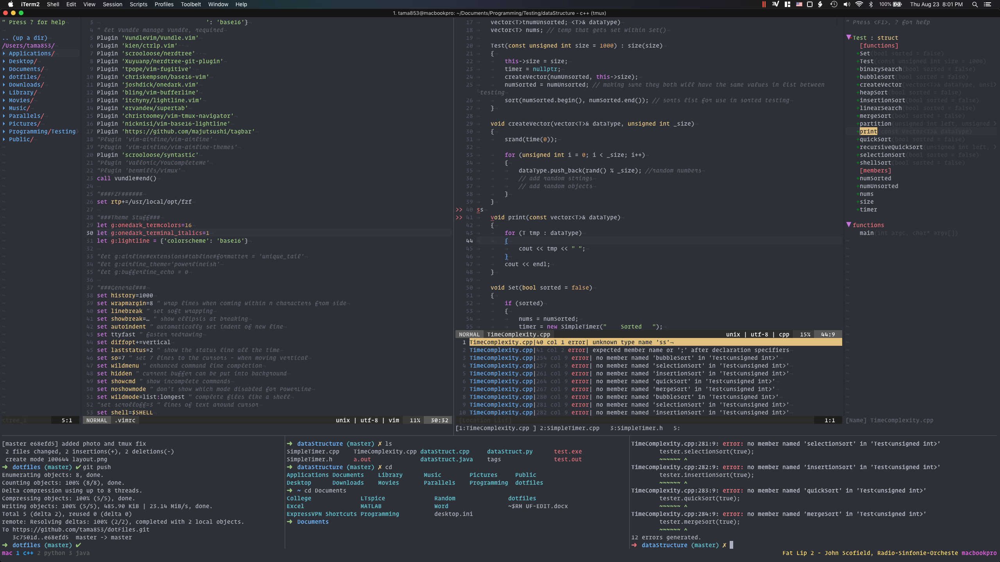

I use iterm2 on  macosx, and this is my current setup using nvim, tmux, and zsh. Many thanks to 
Nick Nisi for his amazing work putting together a very well documented README so that I could begin to travel down this rabbit hole of vim and customizations--there have been many before me and there will surely be more to follow. For those who have yet to follow, don't initially get discouraged by vim in a world of modern IDE's, because all good things come in time.

NERDTree and Tagbar are both set to be toggled with keybinds Leader' and Leader~ which makes good use of the tilde key. I am still configuring the Tmux keybinds to work by transitioning between vim splits and Tmux panes. The plugin that I am using now doesn't allow me full coverage. Here is a cluttered view dispalying the previously mentioned as well as Syntastic.

